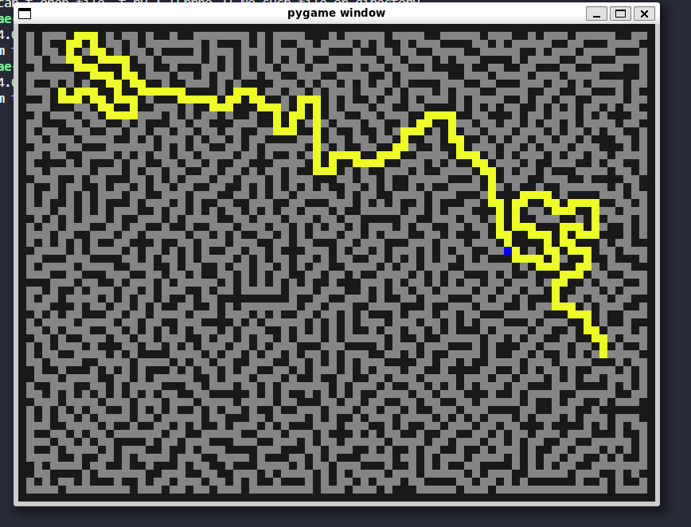
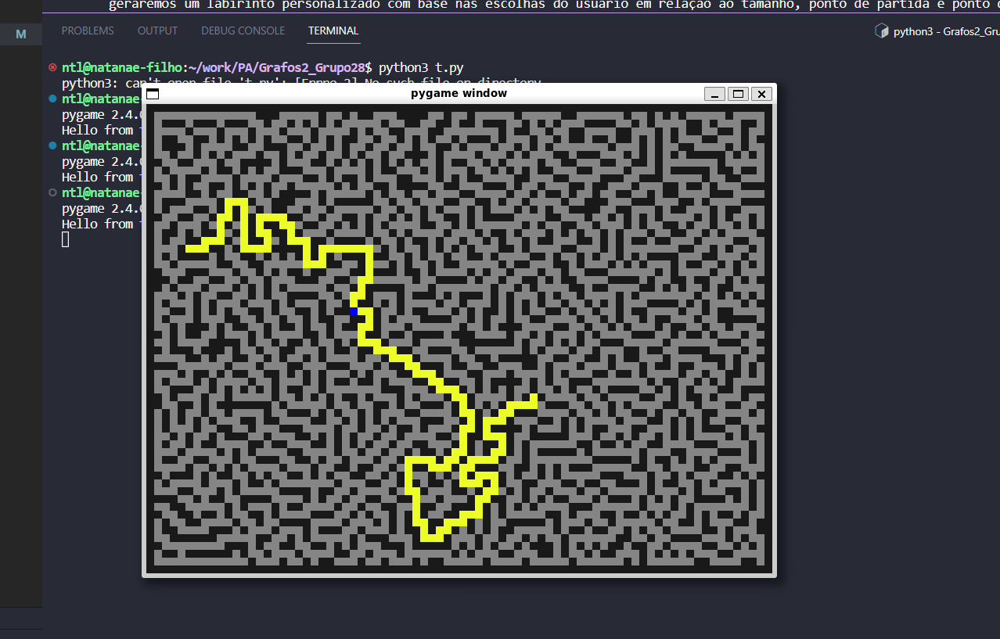
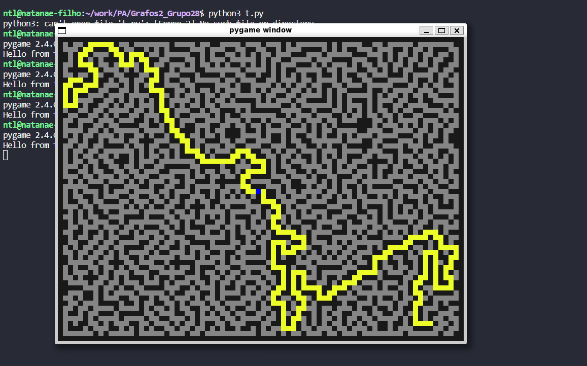

# Grafos2_MazeExplorer

**Número da Lista**: 28<br>
**Conteúdo da Disciplina**: Grafos 2<br>

## Alunos
|Matrícula | Aluno |
| -- | -- |
| 19/0042419  |  Davi Matheus da Rocha de Oliveira |
| 19/0058650  |  Natanael Fernandes Coelho Filho |

## Sobre 
Neste projeto, exploraremos a combinação de algoritmos para criar e resolver labirintos. Utilizando o algoritmo de Kruskal, geraremos um labirinto personalizado com base nas escolhas do usuário em relação ao tamanho, ponto de partida e ponto de chegada. Em seguida, aplicaremos o algoritmo de Dijkstra para encontrar a solução ótima desse labirinto. A solução será exibida através de uma interface gráfica que apresentará gradualmente o caminho mais curto para a saída.

## Screenshots






## Instalação 
**Linguagem**: Python<br>
**Framework**: Nenhum<br>

python main.py

## Uso 

### Pré-requisitos

Antes de executar o programa, certifique-se de ter o Python 3 instalado em seu sistema. Você pode fazer o download da versão mais recente do Python em python.org.

### Instalação de Requisitos

O programa requer algumas dependências que devem ser instaladas, desta forma siga as etapas abaixo:

1. Abra o terminal e navegue até o diretório do projeto.

2. Execute o seguinte comando para instalar as dependências:

```shell
pip install -r requirements.txt
# Isso garantirá que todas as bibliotecas necessárias sejam instaladas corretamente.
```

### Executando o Programa

Após ter instalado os requisitos, você pode executar o programa seguindo estas etapas:

1. Execute o seguinte comando para iniciar o programa:

```shell
python3 main.py
```

Caso tenha instalado corretamente as dependencias do projeto, será inicializado uma interface com a execução do programa.


Para fechar a Interface você pode pressionar o botão "X" no canto superior direito da janela ou do proprio teclado. Isso encerrará o programa corretamente.

## Outros 
Para criar um novo labirinto, saia da execução atual e execute novamente o código.
A geração do ponto de partida e ponto de chegada do labirinto é feita de forma aleatória, o que significa que às vezes o labirinto pode ser maior ou menor do que o desejado.

Abaixo segue link para acessar ao video publicado: <https://www.youtube.com/watch?v=PthGa1tCLtM>


